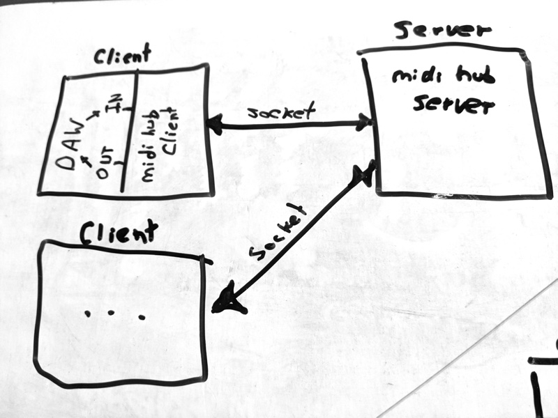
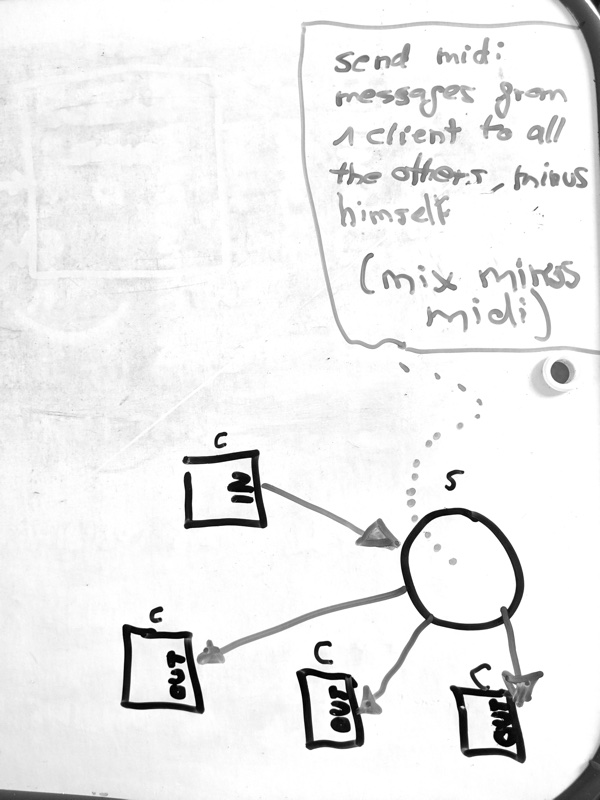

# Network MIDI Hub

## Description
A client/server interface to connect multiple clients to a centralized MIDI server. 



All the MIDI messages received on the client, will be forwared to the server and that will be retransmitted to all the connected clients minus the sender. Locally the client spawn a virtual midi device to allow easy connection with any compatible midi app (DAW, Pd, Max, Supercollider, ...)



## Usage

### Client

Install pipenv and pyenv on your system (mac instructions assuming brew installed):

```
brew install pyenv pipenv
```

run a sync:

```
pipenv sync
```

When you have an environment with pipenv you can run it by:

```
pipenv run python client.py --host SERVER_HOST
```

if you don't pass the `--host` argument, it will default to localhost (127.0.0.1)

Docker is not yet an option as this application spawns MIDI ports that are not shared on the host system. Hopefully using pipenv makes it quite portable.

### Server

```
pipenv run python server.py
```

By default it runs on the port 8141 and listen to 0.0.0.0

The server it can also be run on docker

```
docker build -t network-midi-hub-server .
docker run -p8141:8141 --rm network-midi-hub-server

```

## Development

### TODO

- For now is based in TCP sockets, probably will be more performant in latency using UDP.
- Midi messages sent on the network to be transformed on the smallest format possible
- Windows Support: midi ports spawn on windows don't work
- Fix broken pipes on big messages
- Refine split messages

### Pipenv

The requirements are created using pipenv. In order to use the same environment you can run:

```pipenv sync && pipenv shell```

To update the requirements you can modify the Pipfile and run

```docker run --rm -v `pwd`:/workspace -e PIPENV_PIPFILE=Pipfile 3amigos/pipenv-all bash -c "pipenv lock -r > requirements.txt"```
