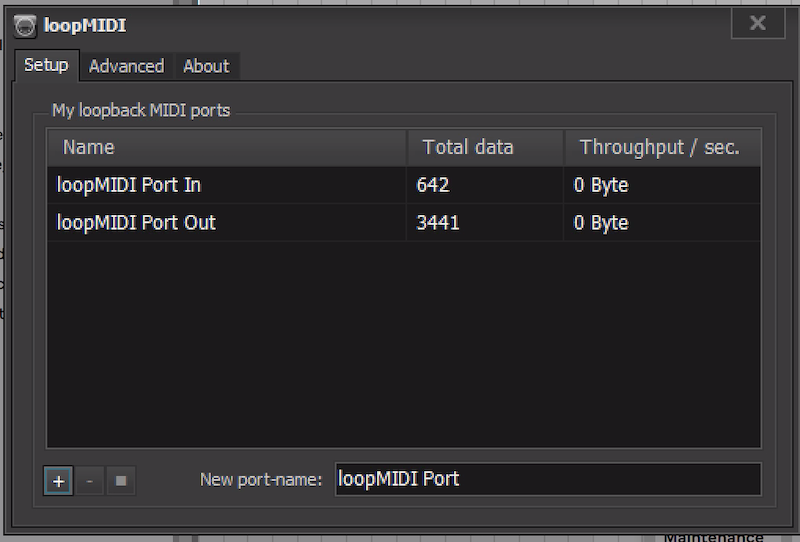
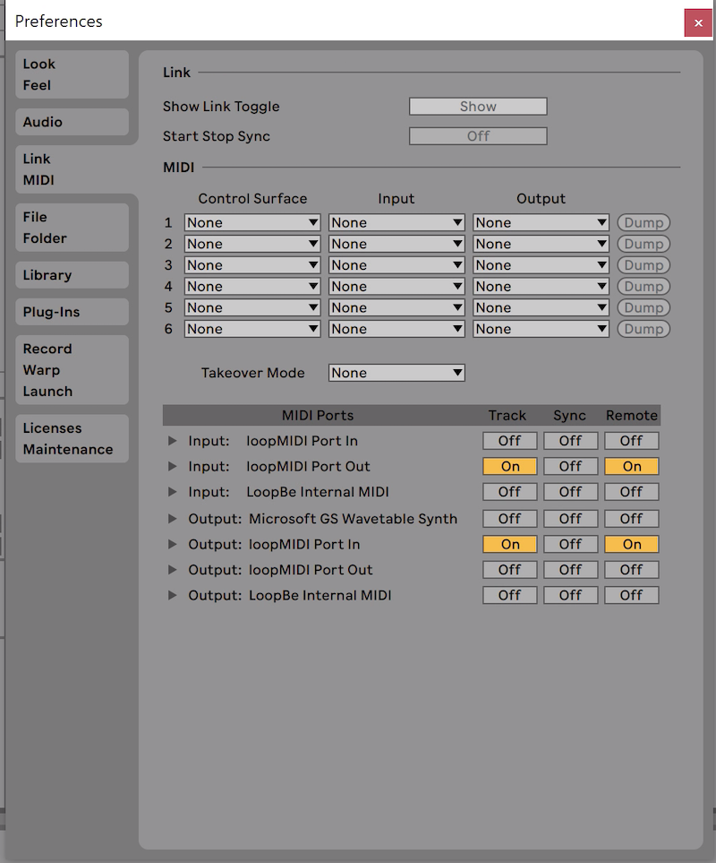

# Network MIDI Hub

## Description
A client/server interface to connect multiple clients to a centralized MIDI server. 


All the MIDI messages received on the client, will be forwared to the server and that will be retransmitted to all the connected clients minus the sender. Locally the client spawn a virtual midi device to allow easy connection with any compatible midi app (DAW, Pd, Max, Supercollider, ...)


## Usage

TLDR;

If you want to kickstart and run it, just download the binaries and execute them

### Binaries

On the _dist_ folder you have the binaries for Mac (Mojave or higher) and Windows.

Check instructions for the Windows Client, as it needs extra care.

### Client

#### Non binaries - OSX
Install pipenv and pyenv on your system (mac instructions assuming brew installed):

```
brew install pyenv pipenv
```

run a sync:

```
pipenv sync
```

When you have an environment with pipenv you can run it by:

```
pipenv run python client.py
```

#### Windows Client
Is not supported to spawn Virtual Midi ports on Windows without the use of third party application. I've found a workaround using [loopMidi](http://www.tobias-erichsen.de/software/loopmidi.html).

Once installed, open loopMidi and remove any existing ports, then add the ports as shown on this image:



And then setup your DAW/Audio MIDI ports as similar to this:



Don't be fooled by inputs and output _dislexia_, If doesn't work at the first time, just switch to the opposite on you application.

The client "autoguess" if it's ran on Windows OS, to switch to this specific configuration.

Check the 'Development instructions' below if you prefer to not run the binaries and use python to setup your environment accordingly.


### Server

By default it runs on the port 8141 and listen to 0.0.0.0

The server it can also be run on docker

```
docker build -t network-midi-hub-server .
docker run -p8141:8141 --rm network-midi-hub-server

```

## Development

### TODO

[See Issues](https://github.com/piscue/network-midi-hub/issues)

### Pipenv

The requirements are created using pipenv. In order to use the same environment you can run:

```
pipenv sync && pipenv shell
```

To update the requirements you can modify the Pipfile and run

```
docker run --rm \
-v `pwd`:/workspace \
-e PIPENV_PIPFILE=Pipfile \
3amigos/pipenv-all bash -c \
"pipenv lock -r > requirements.txt && pipenv lock -r --dev > requirements-dev.txt"
```

### pyinstaller

#### OSX / Linux:

Linux specific:

```
# install pyenv build dependencies
sudo apt-get install -y build-essential libssl-dev zlib1g-dev libbz2-dev \ -->
libreadline-dev libsqlite3-dev wget curl llvm libncurses5-dev libncursesw5-dev \
xz-utils tk-dev libffi-dev liblzma-dev python-openssl git

# asound libjack libraries
sudo apt install libasound2-dev libjack-dev
```

Setup a Python that has CPython shared-library enabled:

```
env PYTHON_CONFIGURE_OPTS="--enable-shared" pyenv install 3.8.6
```

go inside the the environment:
```
pipenv sync --dev
```

create an executable of the client and server:
```
pipenv run pyinstaller -F --noconfirm --hiddenimport mido.backends.rtmidi client.py
pipenv run pyinstaller -F --noconfirm --hiddenimport mido.backends.rtmidi server.py
```

#### Windows 10

Install pyenv-win and pipenv
Setup a Python that has CPython shared-library enabled:
```
set PYTHON_CONFIGURE_OPTS '--enable-shared'
pyenv install 3.8.6
```

go inside the environment, install modules:
```
py -m pipenv --python /Users/Shadow/.pyenv/pyenv-win/versions/3.8.6/python3.exe shell
pip install -r .\requirements-dev.txt
```

To create the Windows executable is the same command

```
pyinstaller -F --noconfirm --hiddenimport mido.backends.rtmidi client.py
```
