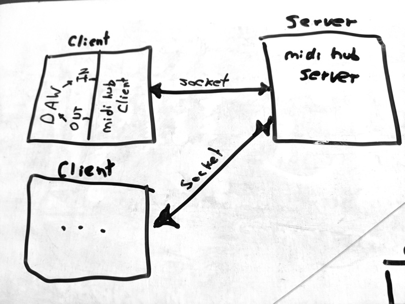
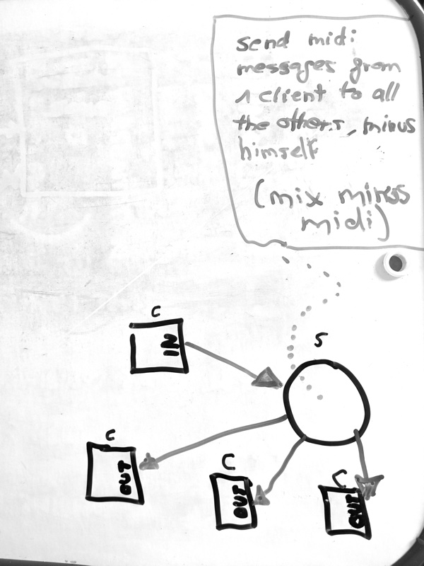
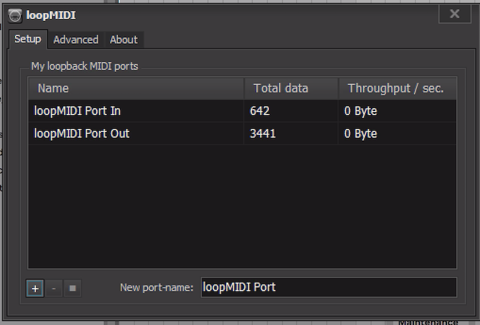
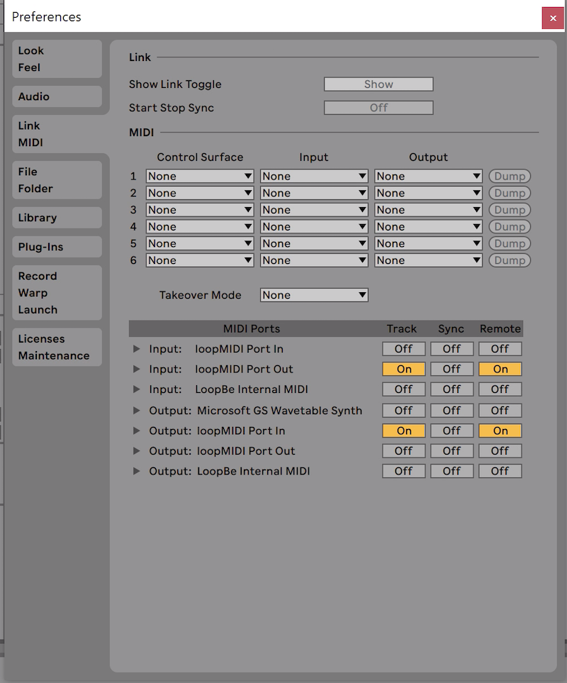

# Network MIDI Hub

A client/server system for sharing MIDI between multiple machines over a network. All MIDI messages received from any client are broadcast to every other connected client — a mix-minus hub for MIDI.



On each client machine, the client spawns a virtual MIDI port so any local MIDI app (DAW, Pd, Max, SuperCollider, etc.) can connect to it without extra configuration.



---

## How it works

| Component | What it does | Where it runs |
|---|---|---|
| `server.py` | TCP hub — receives MIDI bytes from any client and forwards them to all others | Always-on machine or Docker |
| `client.py` | Bridges your local MIDI ports to the server over TCP | Your music machine |

**Dependencies:** `server.py` is pure Python stdlib. `client.py` requires `mido` + `python-rtmidi` to talk to real MIDI hardware.

---

## Quickstart — binaries (recommended)

Download the latest binaries from the [Releases](https://github.com/piscue/network-midi-hub/releases) page. Each release ships self-contained executables — no Python or pip needed.

```
network-midi-hub-osx.tgz          → client, server          (macOS)
network-midi-hub-linux.tgz        → client, server          (Linux x86-64)
network-midi-hub-linux-arm64.tgz  → client, server          (Linux arm64 — Raspberry Pi 3/4/5, ARM desktops/servers, AWS Graviton, etc.)
network-midi-hub-windows.tgz      → client.exe, server.exe  (Windows)
```

Start the server on any always-on machine:

```bash
./server                        # listens on 0.0.0.0:8141
./server --port 9000            # custom port
./server --bind 192.168.1.10    # bind to specific interface
```

Start the client on each music machine:

```bash
./client                        # prompts for server IP
./client --host 192.168.1.10    # connect directly
./client --thru                 # echo received MIDI back to local output too
```

---

## Server — Docker

The server can run as a Docker container (no Python required on the host):

```bash
docker build -t network-midi-hub-server .
docker run -p 8141:8141 --rm network-midi-hub-server
```

---

## Client — Windows

Windows does not support virtual MIDI ports natively. Use [loopMidi](http://www.tobias-erichsen.de/software/loopmidi.html) as a workaround.

1. Open loopMidi, remove any existing ports, then add two ports exactly as shown:

   

2. Configure your DAW's MIDI ports similarly:

   

   If it doesn't work, try swapping input/output — MIDI port direction naming varies by app.

The client detects Windows automatically and uses the loopMidi port names instead of creating virtual ports.

---

## Development

### Requirements

- [pyenv](https://github.com/pyenv/pyenv) — manage Python versions
- [pipenv](https://pipenv.pypa.io) — manage the virtualenv and dependencies

```bash
brew install pyenv pipenv   # macOS
```

### Setup

```bash
pipenv sync --dev
pipenv shell
```

`pipenv sync` installs everything from `Pipfile.lock` — including `mido` and `python-rtmidi` (needed by `client.py`) and dev tools (`pytest`, `pyinstaller`, etc.).

> **Note:** `requirements.txt` is a Pipenv-generated export used only by the Docker build for `server.py`. It intentionally omits `mido`/`python-rtmidi` because the server doesn't use them and they require ALSA headers to compile. Always use `pipenv sync` for local development.

### Run locally

```bash
# Server
pipenv run python server.py

# Client
pipenv run python client.py --host <server-ip>
```

### Tests

```bash
pipenv run pytest
```

### Build binaries

Linux requires ALSA and JACK headers before building:

```bash
sudo apt install libasound2-dev libjack-dev
```

Build client and server executables:

```bash
pipenv run pyinstaller -F --noconfirm --hiddenimport mido.backends.rtmidi client.py
pipenv run pyinstaller -F --noconfirm --hiddenimport mido.backends.rtmidi server.py
```

Outputs land in `dist/`. The `--hiddenimport mido.backends.rtmidi` flag is required because pyinstaller can't auto-detect the rtmidi backend that mido loads at runtime.

### Update locked dependencies

Modify `Pipfile`, then regenerate the lock file and export the server-only subset:

```bash
pipenv lock
pipenv requirements > requirements.txt       # server deps only (no mido/rtmidi)
pipenv requirements --dev-only > requirements-dev.txt
```
